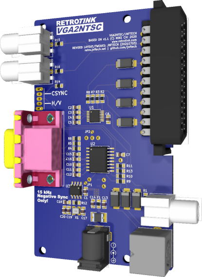
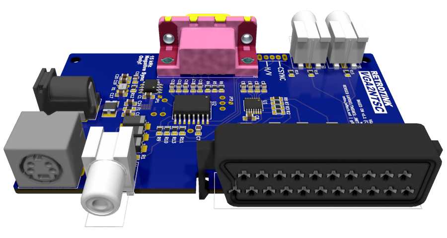
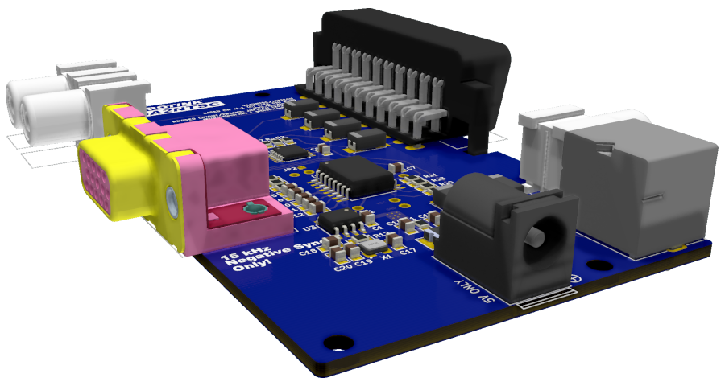

# RetroTINK VGA2NTSC - KiCad Conversion/Modification

This is a modified version of Mike Chi's VGA2NTSC v1.1.
The first goal was to convert the original Altium source files to KiCad - a free and open source tool - as not everyone has access to Altium. Secondly, most footprints have been swapped to make the board more DIY friendly - for example swapping 0402 components (difficult to solder by hand) with 0805 or larger.

As of April 2023, the version shown here is a "final" version (meaning I will no longer make further improvements) that I completed in mid-2021 and only now finally publishing to Github. The changes between the Old version (2020/04/20, archived in the "_Old" folder) and this version are outlined below. 

<p align="center">
  
  
</p>


### Goals:
- Convert original Altium project to KiCad
- Use 0805 footprints instead of smaller packages (original used 0402 components which are difficult to solder by hand)
- Keep location of jacks and mounting holes in the same locations
- Keep circuit identical to original schematics
- Adjust vertical board size slightly to fit within 100x100mm size limit for cheap boards with many popular PCB fabs
- Add a footprint for a DC barrel jack instead of USB power (either-or can be used in the same spot). Warning has been added to the board denoting 5V power only
- Modified power distribution rail using bottom layer of board
- Relocated clock section to minimize routing near other signals or underneath video amp
- Minimized the use of vias for signal traces where possible.
- More KiCad practice for me
- Finally try to publish something on GitHub (first repo!)

### Changed from 2020/04/20 version:
- Tided up board outline and removed some workaround circular holes in some footprints.
- Added selectable HV/CSYNC switch
- AC coupling on the RGB lines of Scart Output (C22 - C25). The original design left these DC coupled. DC coupling can still be achieved by simply jumping the capacitor pads (for example using larger 0 ohm resistors, like 1206 or 1812)
- Added a way to bypass the on-board clock circuit. This might be handy for someone wanting to get PAL output from the board by feeding in an external clock signal (EXT_CLOCK).
  - Note that JP1 must be closed with solder for "normal" MTSC operation using the onboard clock circuit. Leave JP1 open to feed external clock signal.
- Added pads for manipulating the NTSC/PAL pin on the AD725 if desired. Switching to PAL would require a different clock signal (see above).
  - Close JP2 with solder for "normal" NTSC operation.
- Added a YTRAP pad for feeding an external YTRAP circuit to the AD725.

### TL;DR on the two solder jumpers (JP1 and JP2)
- Close these both with solder if you are not using any of the "advanced tinkering features" above.


### Notes:
- The board design uses vias-in-pads. This can be a problem for some fabs. JLCPCB (at least with default HASL plating) and OSHpark dont seem to have an issue with this, but some fabs might depending on how they plate the pads. You may need to adjust the locations of the vias and add a couple traces to compensate, should you run into this situation.

### Tools used for conversion:
- Altium2Kicad https://github.com/thesourcerer8/altium2kicad
- Tracespace View (conversion of original Gerbers to SVG for reference and silkscreen adaptations - Alitum2Kicad doesn’t translate original fonts/graphics) https://tracespace.io/view/
- KiCad 5.1.8 https://www.kicad.org/
- Inkscape https://inkscape.org/

<p align="center">
<br />

<br />
</p>

This derivative work maintains the same source license as the original board.
https://www.retrotink.com/post/vga2ntsc-released

### “Mike Chi” License:
(From https://www.retrotink.com/post/vga2ntsc-released)

```
License
The materials are released under the terms below. I don't have time for pedantic nonsense or legal theory and like to keep things simple. I call this the 'Mike Chi' license.

- For each project, at my sole discretion, I may release whatever sources, to whatever level of abstraction, that I deem appropriate. Additional information/materials may be released on a scheduled determined at my sole discretion.
- You may modify, use or adapt any or all portions of the released material for any purpose you wish, including sale.
- The exception is that the files may not be used for commercial activities by entities, determined at my sole discretion, that have a history of violating intellectual property rights or licenses.
- If these materials were helpful and/or of use to you, I only ask that you provide some form of acknowledgment that you feel is fair.
- I'd also love to hear about how you're using it!
- If you re-distribute the material in a substantially unaltered form, please include this notice.
- NO WARRANTY EXPRESSED OR IMPLIED. WE TAKE ABSOLUTELY NO RESPONSIBILITY FOR WHAT MAY OCCUR FROM USAGE OF THE FILES.
- WE CANNOT AND WILL NOT OFFER ANY SUPPORT FOR THE USAGE OF THE FILES. IF YOU DO NOT AGREE WITH THESE TERMS THEN DO NOT USE ANY OF THE MATERIALS AND DON'T COMPLAIN.
```

https://www.retrotink.com/

